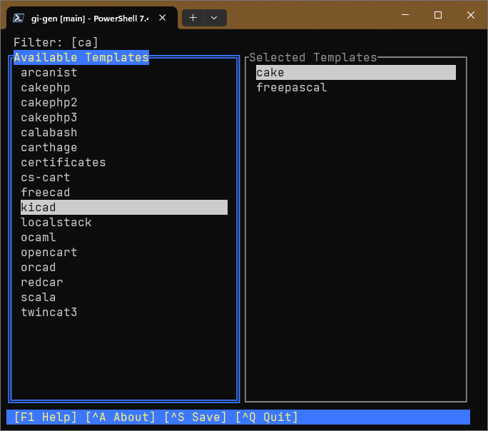

# Using gi-gen (.gitignore generator)
```
> gi-gen --help
Generate .gitingore file using gitignore.io API

Usage: gi-gen.exe [COMMAND]

Commands:
list         List available templates with optional filter applied
generate     Generate .gitignore using specified template(s)
interactive  Pick templates interactively and generate .gitignore (default)
help         Print this message or the help of the given subcommand(s)

Options:
-h, --help     Print help
-V, --version  Print version
```
### List
#### Usage: `gi-gen.exe list [FILTER]`

Writes a list of the available .gitignore templates to `stdout`.
If an optional filter is included, the list will only show templates
that *contain* the filter text.
### Generate
#### Usage: `gi-gen generate <template>...`

Writes the specified template or templates to `stdout`, which can be
redirected to a `.gitignore` file. At least one template must be specified.

### Interactive
#### Usage: `gi-gen` or `gi-gen interactive`


*Note: This screenshot shows the list of available templates filtered on "ca", 
and the `cake` and `freepascal` templates selected.*

Displays the available templates in a text-mode user interface.
You may select one or more templates to generate a `.gitignore` file for.

- To select a template, highlight it in the list of available templates
  and press `Enter` or the space bar to select it.
- You may type in a filter to be applied to the list.
- To unselect a template, press `Tab` to move focus to the list of selected
  templates. Highlight the template and press `Enter` or the space
  bar to remove it from the list of selected templates.
- Press Ctrl+S to save the selected template or templates to the `.gitignore` file
  in the current directory. If there is already a `.gitignore` file there,
  the program will prompt you to replace it, append to it, or to cancel the
  operation.
